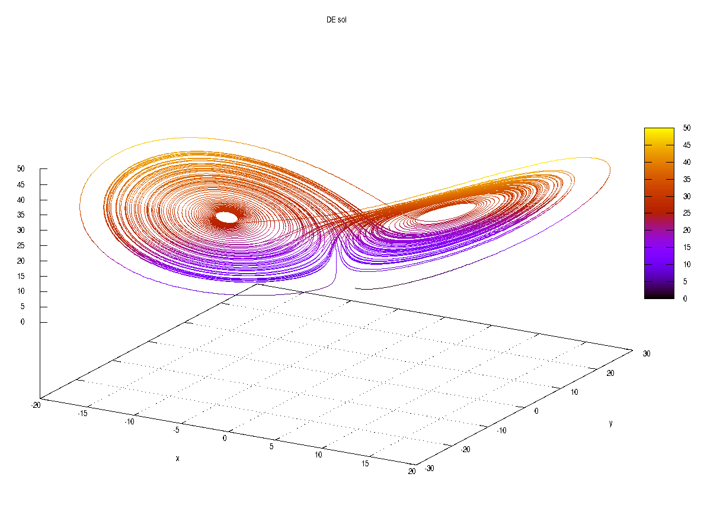
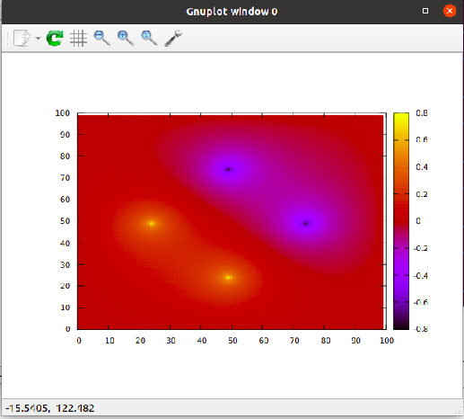
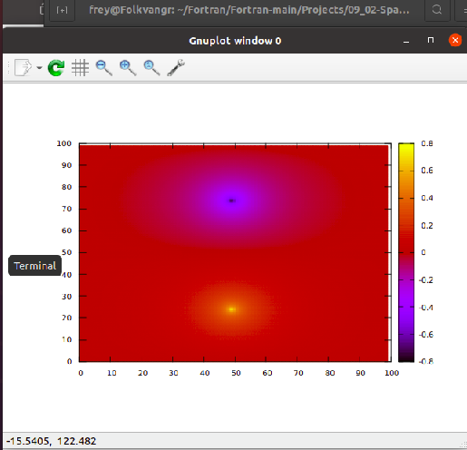
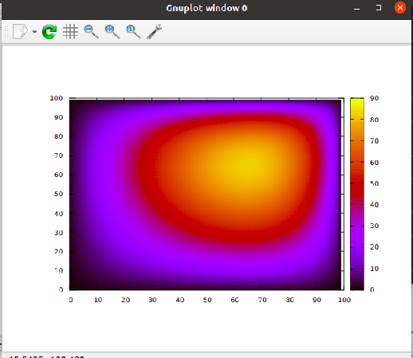

# Seasons of Code

### Project: Simulations in Physics

Over a period of 8 weeks, I am going to fill this repo with projects and progress! 
Interesting simulations might even get their own websites if I have time! 

Going to write the high-performant code in Fortran!

Step 1: Learn fortran. Check!
[https://github.com/Sam-MARTis/Fortran](https://github.com/Sam-MARTis/Fortran)

Step 2: Complete Week 0 Assignment. Check!
[https://github.com/Sam-MARTis/Seasons_of_Code__Simulations_in_Physics/tree/main/Learning/Week0/assignment/solutions](https://github.com/Sam-MARTis/Seasons_of_Code__Simulations_in_Physics/tree/main/Learning/Week0/assignment/solutions)

Step 3: Completed Week 1 Assignment, learn to plot using gnuplot, write reusable, modular code... CHECK!
[https://github.com/Sam-MARTis/Seasons_of_Code__Simulations_in_Physics/tree/main/Learning/Week1/assignment/solutions](https://github.com/Sam-MARTis/Seasons_of_Code__Simulations_in_Physics/tree/main/Learning/Week1/assignment/solutions)

Step 4: Week 2 and 3 assignments completed. Linear system of equation solvers and Poisson equation solving
[https://github.com/Sam-MARTis/Seasons_of_Code__Simulations_in_Physics/tree/main/Learning/Week2_3](https://github.com/Sam-MARTis/Seasons_of_Code__Simulations_in_Physics/tree/main/Learning/Week2_3)

Step 5: Pick an open-ended project topic! Thinking of one rn.

Ad astra!

