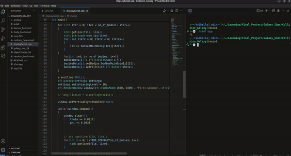

# Seasons of Code

### Project: Simulations in Physics

Over a period of 8 weeks, I am going to fill this repo with projects and progress! 
Interesting simulations might even get their own websites if I have time! 

Going to write the high-performant code in Fortran!

Step 1: Learn fortran. Check!
[https://github.com/Sam-MARTis/Fortran](https://github.com/Sam-MARTis/Fortran)

Step 2: Complete Week 0 Assignment. Check!
[https://github.com/Sam-MARTis/Seasons_of_Code__Simulations_in_Physics/tree/main/Learning/Week0/assignment/solutions](https://github.com/Sam-MARTis/Seasons_of_Code__Simulations_in_Physics/tree/main/Learning/Week0/assignment/solutions)

Step 3: Completed Week 1 Assignment, learn to plot using gnuplot, write reusable, modular code... CHECK!

Learnt how to code forward-euler and RK4 methods among other things.
[https://github.com/Sam-MARTis/Seasons_of_Code__Simulations_in_Physics/tree/main/Learning/Week1/assignment/solutions](https://github.com/Sam-MARTis/Seasons_of_Code__Simulations_in_Physics/tree/main/Learning/Week1/assignment/solutions)

Step 4: Week 2 and 3 assignments completed. Linear system of equation solvers and Poisson equation solving.
Represented the system in matrix form and solved using numerical solver
[https://github.com/Sam-MARTis/Seasons_of_Code__Simulations_in_Physics/tree/main/Learning/Week2_3](https://github.com/Sam-MARTis/Seasons_of_Code__Simulations_in_Physics/tree/main/Learning/Week2_3)

Step 5: Pick an open-ended project topic! 
I chose N-body simulations. Namely, N-body gravity simulations.
Generally, if one using simple gravity calcilation algorithms, you cannot simulate more than 600 or so particles in a reasonable amount of time. $O(n^2)$ is the time complexity of the convential "check everything against everything else" algorithm.

I wanted to be able to simulate more than 600. I chose a goal of 5k particles. I would achieve this using the "Barnes-Hut" algorithm.

For this, I had to implement a spatial data structure called a "Quad-tree". Then I could use the Quad tree to implement Barnes-Hut. The algorithm trades off a bit of accuracy for a lot of speed, reducing the complexity from $O(n^2)$ to $O(n\log(n))$, which is a huge improvement.

I was able to simulate 5k particles, ie my goal. The simulation took me 3 minutes to execute for 5k particles, 30k iterations and a dt of 0.01

I write the co-ordinates of the points into a file and then call a c++ executable that plots it using SFML (Super Fast Media Library)

The C++ script also performs additional linear algebra and scaling to give the effect of the galaxy rotating and the particles being viewed through an isometric view.

The main bottleneck for this process is the speed of writing into the file, hence using different algorithms will not necesarrily increase the speed past a point. 

The solution to this would be to re-write the code in a different lanaguage that can efficiently handle both computation and display. The prime canditate for it is Julia, which has the additional benefit of being able to run natively on the GPU.

## Closing remarks:
AMAZING experience. Definitely reccomended for others to try. Thank you to the mentors, Mridul Goel and Apurv keep, for the oppurtunity and guidance.

